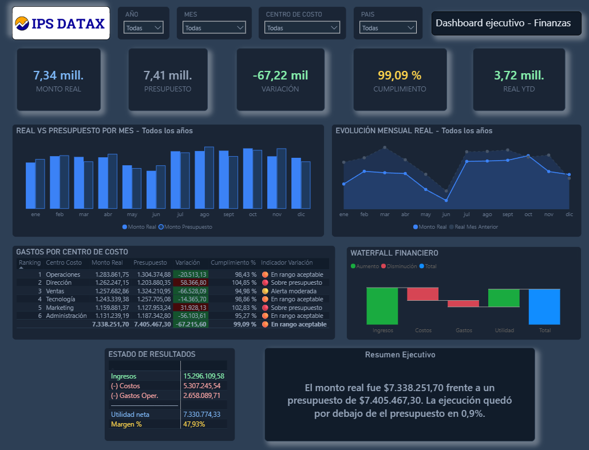

# 📊 Dashboard Ejecutivo — Análisis Financiero Avanzado

> ETL avanzado en Power Query · Limpieza de datos multicapa · Modelo estrella · DAX financiero · Inteligencia de tiempo

---

## 🛠️ Stack Tecnológico

| Herramienta | Uso |
|---|---|
| **Power BI Desktop** | Visualización y dashboard ejecutivo interactivo |
| **Power Query (M)** | ETL, limpieza y transformación de datos |
| **DAX** | Medidas financieras, KPIs, inteligencia de tiempo y texto dinámico |
| **Excel** | Fuente de datos origen con múltiples inconsistencias intencionales |
| **Python (pandas)** | Validación y auditoría de valores de referencia |

---

## 🎯 Objetivo

Desarrollo de un **dashboard financiero ejecutivo** a partir de un dataset con inconsistencias complejas de calidad de datos, aplicando un flujo completo de EDA, ETL avanzado en Power Query, modelado dimensional y análisis financiero con DAX, incluyendo Estado de Resultados, variaciones presupuestales e inteligencia de tiempo.

---

## 📂 Estructura del Repositorio

```
📦 dashboard-finanzas-avanzado-powerbi
├── 📊 finanzas.pbix
├── 📂 dataset/
│   └── Proyecto_Finanzas_Avanzado_Power_BI.xlsx
├── 📂 screenshots/
│   └── dashboard_ejecutivo_finanzas.png
└── 📄 README.md
```

---

## 🔍 EDA — Análisis Exploratorio Inicial

Antes de cualquier transformación se realizó un análisis exhaustivo del dataset crudo para identificar todos los problemas de calidad de datos:

### Dataset original — `Fact_Finanzas_Raw`

| Dimensión | Detalle |
|---|---|
| Registros | 3.452 filas × 7 columnas |
| Período | Enero 2024 — Diciembre 2025 |
| Moneda | USD |

### Problemas detectados por columna

| Columna | Problema | Registros afectados |
|---|---|---|
| `Fecha` | Fechas imposibles (`00/01/2024`, `31/02/2025`) y texto `"sin fecha"` | 150 |
| `Monto` | 5 formatos distintos mezclados (europeo, anglosajón, paréntesis contable, prefijos USD/$, float con imprecisión) | 434 |
| `Moneda` | Celdas vacías sin valor | 2.199 |
| `Escenario` | Variantes inconsistentes: `"Ppto"` y `"Presup"` | 24 |
| `CuentaID` | Nulos y código huérfano `Cta_9999` sin match en dimensión | 81 |
| `CentroCostoID` | Nulos sin correspondencia | 48 |

---

## ⚙️ Proceso ETL — Power Query (Lenguaje M)

Todo el proceso de limpieza se implementó paso a paso en Power Query para garantizar trazabilidad, reproducibilidad y auditoría de cada transformación.

### 🗓️ Columna `Fecha`

- Conversión a tipo texto para detectar valores inválidos
- Reemplazo de `"sin fecha"`, `"00/01/2024"` y `"31/02/2025"` por `null`
- Conversión a tipo `date`
- **Fill Down** para propagar la fecha válida anterior hacia las filas con `null`

### 💰 Columna `Monto`

El reto más complejo del proyecto — 5 formatos distintos en una sola columna:

```
37342              → Entero simple
33,203             → Anglosajón (coma = miles)
5135.41            → Decimal simple
-4.854,25          → Europeo (punto = miles, coma = decimal)
(5,046.40)         → Notación contable (paréntesis = negativo)
USD 33,203         → Con prefijo de moneda
$38,380.20         → Con símbolo $
-8105.5999999985   → Float con imprecisión de punto flotante (celdas numéricas de Excel)
N/C / pendiente    → Valores no recuperables → null
```

### 🔧 Otras transformaciones

| Columna | Transformación |
|---|---|
| `Moneda` | Reemplazo de `null` → `"USD"` |
| `Escenario` | Normalización: `"Ppto"` y `"Presup"` → `"Presupuesto"` |
| `CuentaID` | Eliminación de registros nulos y con `Cta_9999` |
| `CentroCostoID` | Eliminación de registros nulos |

### 📊 Resultado post-limpieza

| Métrica | Antes | Después |
|---|---|---|
| Total registros | 3.452 | **3.211** |
| Registros eliminados | — | 241 |
| Fechas nulas | 150 | **0** (fill down) |
| Montos nulos | 155 | **0** (eliminados) |
| Escenarios distintos | 5 variantes | **2** (Real / Presupuesto) |

---

## 🌟 Modelo de Datos

Arquitectura **modelo estrella** con 5 tablas:

```
Calendario ─────────────────────────────────────┐
                                                 │
Cuentas ──────────────────────────────────────── Finanzas (Fact)
                                                 │
CentroCosto ─────────────────────────────────────┤
                                                 │
Escenario ───────────────────────────────────────┘
```

| Tabla | Tipo | Filas |
|---|---|---|
| `Finanzas` | Hechos | 3.211 |
| `Cuentas` | Dimensión | 12 |
| `CentroCosto` | Dimensión | 6 |
| `Escenario` | Dimensión | 2 |
| `Calendario` | Dimensión tiempo | Dinámica |

---

## 📐 Medidas DAX
 
### Medidas base
```dax
Monto Total = SUM(Finanzas[Monto])
Monto Real = CALCULATE([Monto Total], Finanzas[Escenario] = "Real")
Monto Presupuesto = CALCULATE([Monto Total], Finanzas[Escenario] = "Presupuesto")
```
 
### Medidas financieras
```dax
Ingresos = CALCULATE([Monto Real], Cuentas[Tipo] = "Ingreso")
Costos   = ABS(CALCULATE([Monto Real], Cuentas[Tipo] = "Costo"))
Gastos   = ABS(CALCULATE([Monto Real], Cuentas[Tipo] = "Gasto Operacional"))
Utilidad = [Ingresos] - [Costos] - [Gastos]
Margen % = DIVIDE([Utilidad], [Ingresos], 0)
```
 
### Variaciones presupuestales
```dax
Variación vs Presupuesto    = [Monto Real] - [Monto Presupuesto]
Variación %                 = DIVIDE([Variación vs Presupuesto], ABS([Monto Presupuesto]), 0)
Cumplimiento Presupuesto %  = DIVIDE([Monto Real], [Monto Presupuesto], 0)
Indicador Variación         = SWITCH(TRUE(),
    [Cumplimiento Presupuesto %] >= 1,        "🔴 Sobre presupuesto",
    [Cumplimiento Presupuesto %] >= 0.95,     "🟠 En rango aceptable",
    [Cumplimiento Presupuesto %] >= 0.85,     "🟡 Alerta moderada",
    "✅ Bajo presupuesto")
```
 
### Inteligencia de tiempo
```dax
Real Mes Anterior       = CALCULATE([Monto Real], DATESMTD(Calendario[Date]))
Variación Mes Anterior  = [Monto Real] - [Real Mes Anterior]
Monto Real YTD          = CALCULATE([Monto Real], DATESYTD(Calendario[Date]))
```
 
### Texto ejecutivo dinámico
```dax
Texto Ejecutivo Dinámico =
VAR REAL = FORMAT([Monto Real], "#,##0.00")
VAR PPTO = FORMAT([Monto Presupuesto], "#,##0.00")
VAR VARIACION = [Variacion vs Presupuesto]
VAR CUMPLIMIENTO = FORMAT(ABS([Cumplimiento Presupuesto %] - 1), "0.0%")
VAR SIGNO = IF(VARIACION >= 0, "superó", "quedó por debajo de")

RETURN
"El monto real fue $" & REAL &
" frente a un presupuesto de $" & PPTO &
". La ejecución " & SIGNO & " el presupuesto en " & CUMPLIMIENTO & "."
```

### Títulos dinámicos
```dax
Titulo_Grafico_Meses = "REAL VS PRESUPUESTO POR MES — " & SELECTEDVALUE(Calendario[Año], "Todos los años")
Titulo_Grafico_Evolucion_Mensual = "EVOLUCIÓN MENSUAL REAL — " & SELECTEDVALUE(Calendario[Año], "Todos los años")
```

---

## 🖥️ Dashboard

Dashboard ejecutivo de una sola página con diseño oscuro profesional (`#0F1923`):

### Visuals incluidos

| # | Visual | Descripción |
|---|---|---|
| 1 | Segmentadores | Año · Mes · Centro de Costo · País |
| 2 | 5 Tarjetas KPI | Real · Presupuesto · Variación · Cumplimiento · YTD |
| 3 | Barras agrupadas | Real vs Presupuesto por mes |
| 4 | Gráfico de líneas | Evolución mensual con mes anterior |
| 5 | Tabla con ranking | Gastos por centro de costo con formato condicional |
| 6 | Tabla dinámica | Estado de resultados (Ingresos → Costos → Gastos → Utilidad → Margen) |
| 7 | Barras agrupadas | Composición financiera: Ingresos / Costos / Gastos / Utilidad |
| 8 | Tarjeta de texto | Resumen ejecutivo dinámico generado por DAX |

### Vista del dashboard



---

## 📈 Resultados & Hallazgos Clave

### Métricas consolidadas del período 2024–2025

| Métrica | Valor |
|---|---|
| 💰 Monto Real total | **$7,338,251.70** |
| 🎯 Presupuesto total | **$7,405,467.30** |
| 📉 Variación absoluta | **-$67,215.60** |
| 📊 Cumplimiento | **99.09%** |
| 🏦 Ingresos | **$15,296,109.58** |
| 💸 Costos | **$5,307,245.54** |
| 🏢 Gastos operacionales | **$2,658,089.71** |
| ✅ Utilidad neta | **$7,330,774.33** |
| 📐 Margen neto | **47.93%** |
| 📅 Real YTD (2025) | **$3,723,958.84** |

### 🔑 Hallazgos del análisis

- **Cumplimiento casi perfecto:** El equipo ejecutó el 99.09% del presupuesto — una brecha de solo $67K sobre $7.4M presupuestados, lo que indica una planificación financiera muy precisa.

- **Margen neto saludable del 47.93%:** De cada $100 de ingresos, $47.93 se convierten en utilidad neta después de descontar costos y gastos operacionales.

- **Los costos representan el 34.7% de los ingresos** y los gastos operacionales el 17.4%, dejando un margen operativo sólido y estructura de costos controlada.

- **Variación negativa concentrada en ciertos centros:** El análisis por centro de costo revela que Ventas (-$66,528) y Tecnología (-$14,365) explican la mayor parte de la subejecución, mientras Dirección (+$58,366) y Marketing (+$31,928) superaron su presupuesto.

- **Calidad de datos crítica:** El dataset original presentaba 5 formatos distintos de número en una sola columna y 241 registros con datos irrecuperables — un caso real de datos en producción que requirió lógica M avanzada para su normalización.

- **2025 supera a 2024:** El Real de 2025 ($3,723,958.84 YTD) supera al de 2024 ($3,614,292.86 completo), evidenciando crecimiento interanual positivo.

---

## ✅ Validación de datos

Los valores del dashboard fueron auditados contra cálculos independientes en Python (pandas) para garantizar la integridad de las transformaciones:

| Medida | Python | Power BI | ✓ |
|---|---|---|---|
| Total registros | 3.211 | 3.211 | ✅ |
| Suma Total Monto | 14,743,719.00 | 14,743,719.00 | ✅ |
| Monto Real | 7,338,251.70 | 7,338,251.70 | ✅ |
| Monto Presupuesto | 7,405,467.30 | 7,405,467.30 | ✅ |
| Variación | -67,215.60 | -67,215.60 | ✅ |

---

*Proyecto desarrollado como parte del portafolio de análisis de datos — IPS Datax.*
