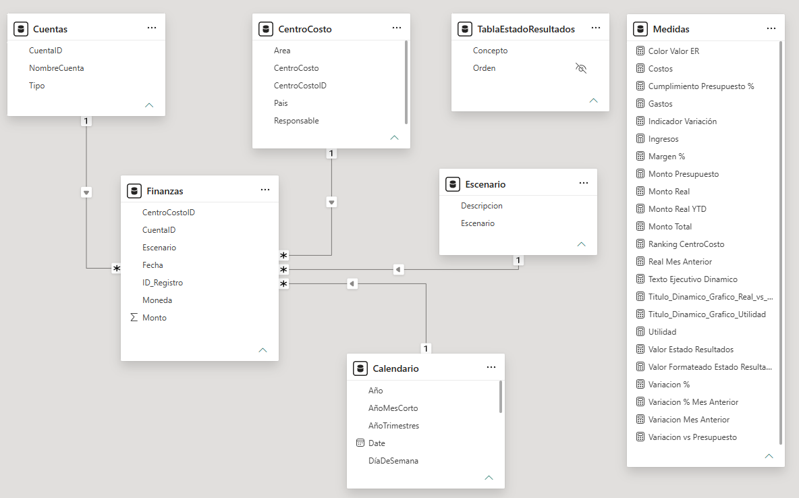
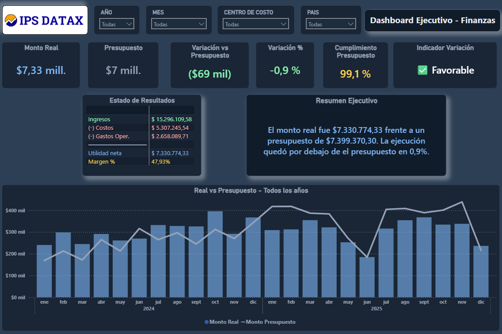
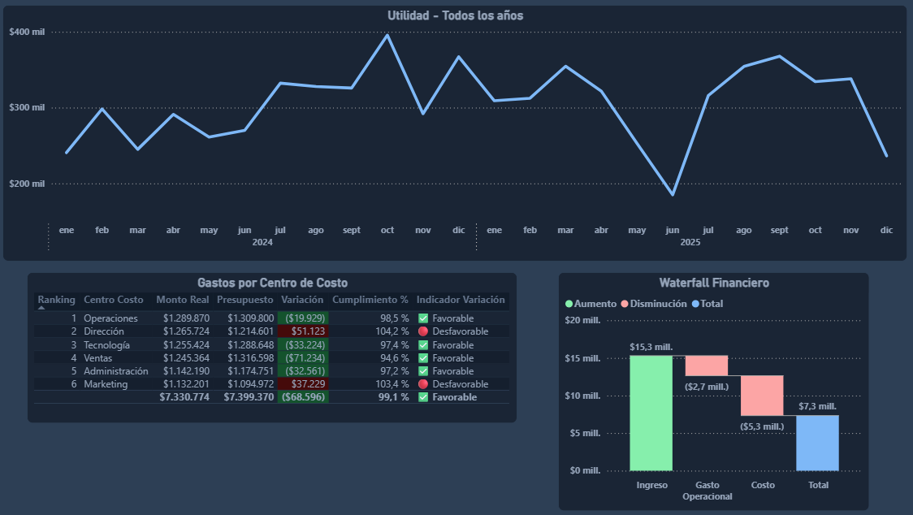
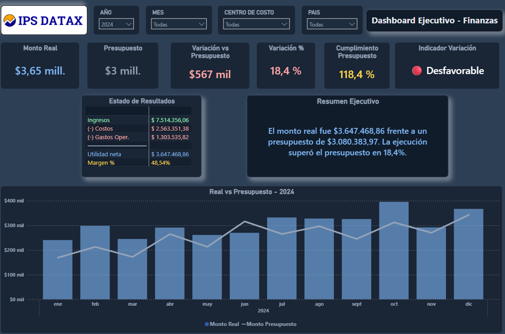
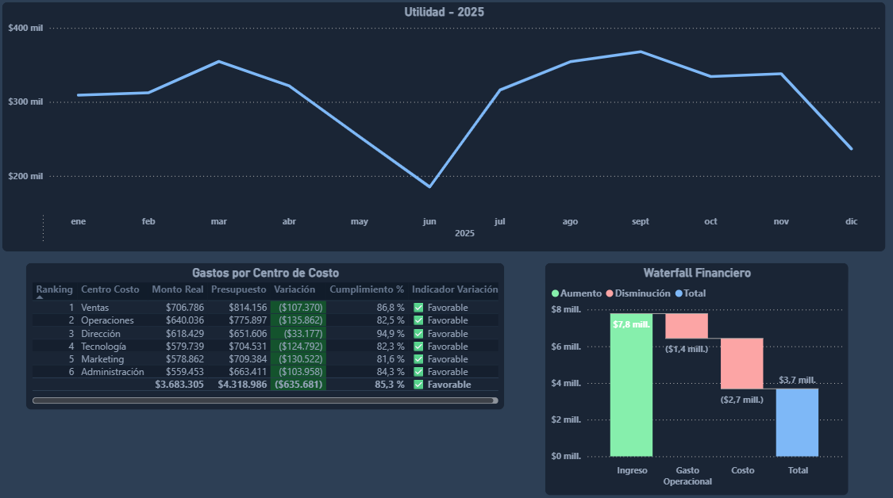

# 📈 Dashboard Ejecutivo — Análisis Financiero Avanzado

> ETL avanzado en Power Query · Limpieza de datos multicapa · Modelo estrella · DAX financiero · Inteligencia de tiempo

---

## 🛠️ Stack Tecnológico

| Herramienta | Uso |
|---|---|
| **Power BI Desktop** | Visualización y dashboard ejecutivo interactivo |
| **Power Query (M)** | ETL, limpieza y transformación de datos |
| **DAX** | Medidas financieras, KPIs, inteligencia de tiempo y texto dinámico |
| **Excel** | Fuente de datos origen con múltiples inconsistencias intencionales |

---

## 🎯 Objetivo

Desarrollo de un **dashboard financiero ejecutivo** a partir de un dataset con inconsistencias complejas de calidad de datos, aplicando un flujo completo de EDA, ETL avanzado en Power Query, modelado dimensional y análisis financiero con DAX, incluyendo Estado de Resultados, variaciones presupuestales e inteligencia de tiempo.

---

## ❓ Preguntas que responde este dashboard

- ¿La empresa está cumpliendo el presupuesto financiero?
- ¿Qué tan rentable es la operación?
- ¿Qué centros de costo presentan mayores variaciones?
- ¿Cómo evolucionan los resultados frente al año anterior?
- ¿Cuál es el impacto de costos y gastos sobre la utilidad?

---

## 🗂 Estructura del Repositorio

```
📶 dashboard-finanzas-avanzado-powerbi
├── 📈 finanzas.pbix
├── 📂 dataset/
│   └── Proyecto_Finanzas_Avanzado_Power_BI.xlsx
├── 📂 screenshots/
│   └── dashboard_ejecutivo_finanzas_1.png
│   └── dashboard_ejecutivo_finanzas_2.png
│   └── dashboard_ejecutivo_finanzas_3_filtro_2024.png
│   └── dashboard_ejecutivo_finanzas_4_filtro_2025.png
│   └── vista_de_modelo.png
└── 📄 README.md
└── 📄 medidas_dax_documentacion.md
```

---

## 🔍 EDA — Análisis Exploratorio Inicial

Antes de cualquier transformación se realizó un análisis exhaustivo del dataset crudo para identificar todos los problemas de calidad de datos:

### Dataset original — `Fact_Finanzas_Raw`

| Dimensión | Detalle |
|---|---|
| Registros | 3.452 filas × 7 columnas |
| Período | Enero 2024 — Diciembre 2025 |
| Moneda | USD |

### Problemas detectados por columna

| Columna | Problema | Registros afectados |
|---|---|---|
| `Fecha` | Fechas imposibles (`00/01/2024`, `31/02/2025`) y texto `"sin fecha"` | 150 |
| `Monto` | 5 formatos distintos mezclados (europeo, anglosajón, paréntesis contable, prefijos USD/$, float con imprecisión) | 434 |
| `Moneda` | Celdas vacías sin valor | 2.199 |
| `Escenario` | Variantes inconsistentes: `"Ppto"` y `"Presup"` | 24 |
| `CuentaID` | Nulos y código huérfano `Cta_9999` sin match en dimensión | 81 |
| `CentroCostoID` | Nulos sin correspondencia | 48 |

---

## 🗃 Proceso ETL — Power Query (Lenguaje M)

Todo el proceso de limpieza se implementó paso a paso en Power Query para garantizar trazabilidad, reproducibilidad y auditoría de cada transformación.

### 🗓️ Columna `Fecha`

- Conversión a tipo texto para detectar valores inválidos
- Reemplazo de `"sin fecha"`, `"00/01/2024"` y `"31/02/2025"` por `null`
- Conversión a tipo `date`
- **Fill Down** para propagar la fecha válida anterior hacia las filas con `null`

### 💰 Columna `Monto`

El reto más complejo del proyecto — 5 formatos distintos en una sola columna:

```
37342              → Entero simple
33,203             → Anglosajón (coma = miles)
5135.41            → Decimal simple
-4.854,25          → Europeo (punto = miles, coma = decimal)
(5,046.40)         → Notación contable (paréntesis = negativo)
USD 33,203         → Con prefijo de moneda
$38,380.20         → Con símbolo $
-8105.5999999985   → Float con imprecisión de punto flotante (celdas numéricas de Excel)
N/C / pendiente    → Valores no recuperables → null
```

### 🔧 Otras transformaciones

| Columna | Transformación |
|---|---|
| `Moneda` | Reemplazo de `null` → `"USD"` |
| `Escenario` | Normalización: `"Ppto"` y `"Presup"` → `"Presupuesto"` |
| `CuentaID` | Eliminación de registros nulos y con `Cta_9999` |
| `CentroCostoID` | Eliminación de registros nulos |

### 📉 Resultado post-limpieza

| Métrica | Antes | Después |
|---|---|---|
| Total registros | 3.452 | **3.211** |
| Registros eliminados | — | 241 |
| Fechas nulas | 150 | **0** (fill down) |
| Montos nulos | 155 | **0** (eliminados) |
| Escenarios distintos | 5 variantes | **2** (Real / Presupuesto) |

---

## 🌟 Modelo de Datos y 📋 Descripción de Tablas

Arquitectura **modelo estrella** con 5 tablas:

Tabla de hechos

- Finanzas

Tablas de dimensión

- Cuentas
- CentroCosto
- Escenario

Tabla dinámica

- Calendario

Tablas adicionales:

- Medidas: para ordenamiento de las medidas DAX creadas.
- TablaEstadoResultados: creada para mostrar la información de la visual de "Estado de Resultados" en el formato deseado.

Se adjunta una imagen del modelo de datos y sus relaciones entre tablas. Relaciones de **Varios a Uno (*:1)**



| Tabla | Tipo | Dimensión | Columnas |
|---|---|---|---|
| `Finanzas` | Hechos | 3.211 | CentroCostoID · CentaID · Escenario · Fecha · Id_Registro · Moneda · Monto |
| `Cuentas` | Dimensión | 12 | CuenaID · NombreCuenta · Tipo |
| `CentroCosto` | Dimensión | 6 | Area · CentroCosto · CentroCostoID · Pais · Responsable |
| `Escenario` | Dimensión | 2 | Descripcion · Escenario |
| `Calendario` | Dimensión tiempo | Dinámica | Relacionadas a valores de fecha | 

---

## 📐 Medidas DAX

Se hizo una documentación de la funcionalidad de cada una de las medidas DAX creadas, remitirse al enlace que se relaciona a continuación.

[📐 Medidas DAX](medidas_dax_documentacion.md)

---

## 🖥️ Dashboard

Dashboard ejecutivo de una sola página con diseño oscuro profesional (`#0F1923`):

### Visuals incluidos

| # | Visual | Descripción |
|---|---|---|
| 1 | Segmentadores | Año · Mes · Centro de Costo · País |
| 2 | Tarjetas KPI | Real · Presupuesto · Variación vs Presupuesto · Variación % · Cumplimiento Presupuesto · Indicador Variación |
| 3 | Tabla - Tarjeta KPI | Composición financiera: Ingresos / Costos / Gastos / Utilidad · Resumen ejecutivo dinámico generado por DAX |
| 4 | Gráfico de columnas apiladas y de líneas | Real vs Presupuesto por mes y año |
| 5 | Gráfico de líneas | Utilidad por mes y año |
| 6 | Tabla con ranking - Gráfico de cascada | Gastos por centro de costo con formato condicional · Comportamiento de los Ingresos → Costos → Gastos |
| 7 | Tabla dinámica | Estado de resultados (Ingresos → Costos → Gastos → Utilidad → Margen)  |

### Imagenes del dashboard




- Filtro aplicado del año 2024



- Filtro aplicado del año 2025



---

## 📋 Resultados & Hallazgos Clave

### Métricas consolidadas del período 2024–2025

| Métrica | Valor |
|---|---|
| 💰 Monto Real total | **$7,330,774** |
| 🎯 Presupuesto total | **$7,399,370** |
| 📉 Variación absoluta | **-$68,596** |
| 📊 Cumplimiento | **99.1%** |
| 🏦 Ingresos | **$15,296,109.58** |
| 💸 Costos | **$5,307,245.54** |
| 🏢 Gastos operacionales | **$2,658,089.71** |
| ✅ Utilidad neta | **$7,330,774.33** |
| 📐 Margen neto | **47.9%** |

### 🔑 Hallazgos del análisis

- **Cumplimiento casi perfecto:** El equipo ejecutó el 99.1% del presupuesto — una brecha de solo $69K sobre $7.4M presupuestados, lo que indica una planificación financiera muy precisa.

- **Margen neto saludable del 47.9%:** De cada $100 de ingresos, $47.93 se convierten en utilidad neta después de descontar costos y gastos operacionales.

- **Los costos representan el 34.7% de los ingresos** y los gastos operacionales el 17.4%, dejando un margen operativo sólido y estructura de costos controlada.

- **Variación negativa concentrada en ciertos centros:** El análisis por centro de costo revela que Ventas (-$71,234) y Tecnología (-$33,224) explican la mayor parte de la subejecución, mientras Dirección (+$51,123) y Marketing (+$37,229) superaron su presupuesto.

---

## 🧠 Conclusiones

### Sobre la calidad de datos y el proceso ETL

El mayor reto del proyecto no fue el análisis financiero, sino la preparación de los datos. El dataset original contenía problemas en prácticamente todas sus columnas — 5 formatos distintos de monto, fechas imposibles, valores texto no recuperables y códigos huérfanos — lo que obligó a diseñar un pipeline de limpieza robusto y trazable en Power Query. Este proceso demostró que en análisis de datos reales, el ETL suele ser la etapa más crítica y la que más tiempo consume, antes de poder hacer cualquier visualización.

La decisión de aplicar **Fill Down** en fechas nulas (en lugar de eliminar los registros) y de usar `ABS()` en costos y gastos (en lugar de cambiar los signos en la fuente) refleja buenas prácticas: respetar la semántica del dato original y aplicar transformaciones explícitas y documentadas.

### Sobre el modelo dimensional

La arquitectura de **modelo estrella** con una tabla de hechos central (`Finanzas`) y cinco dimensiones claramente separadas permitió construir medidas DAX limpias y reutilizables. La creación de `TablaEstadoResultados` como tabla de parámetros fue una decisión de diseño clave: permitió construir el estado de resultados como una visual dinámica sin duplicar lógica, algo que no sería posible sin separar la capa de presentación del modelo de datos.

### Sobre las medidas DAX

El proyecto evolucionó de medidas simples (`SUM`, `CALCULATE`) hacia patrones más avanzados: uso de `DIVIDE()` para evitar errores de división, `ISINSCOPE()` para controlar el comportamiento del ranking en subtotales, y generación de texto narrativo dinámico con `FORMAT()` y concatenación de variables DAX. Esto demuestra que DAX no es solo un lenguaje de cálculo, sino también una herramienta de comunicación ejecutiva cuando se usa correctamente.

### Aprendizajes técnicos clave

- La limpieza de datos con múltiples formatos de un mismo campo requiere una estrategia paso a paso, no un solo reemplazo masivo.
- El modelo estrella facilita el mantenimiento y la escalabilidad: agregar una nueva dimensión no rompe las medidas existentes.
- Las medidas de inteligencia de tiempo (`PREVIOUSMONTH`, `TOTALYTD`) solo funcionan si la tabla de calendario está correctamente construida y relacionada.
- El texto ejecutivo dinámico es una funcionalidad de alto impacto para audiencias no técnicas, y requiere menos esfuerzo de implementación de lo que parece.

---

*Proyecto desarrollado como parte del portafolio de análisis de datos.*
